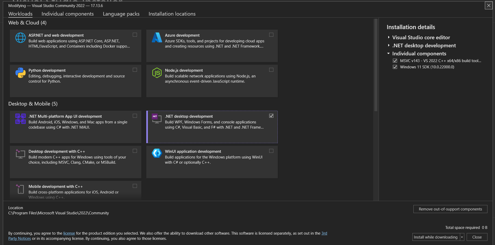

# How to Build This Project

This guide will help first-time contributors set up their environment and build the project.

## Prerequisites

To build this .NET Framework Windows Forms application, you will need the Visual Studio Build Tools with the ".NET desktop development" workload installed.

1.  **Install Visual Studio Build Tools 2022 (Recommended)**

    You can install the Build Tools using `winget`:

    ```bash
    winget install --id Microsoft.VisualStudio.2022.BuildTools --exact --source winget --accept-package-agreements --accept-source-agreements
    ```

2.  **Install .NET desktop development workload**

    After installing the Build Tools (or if you have Visual Studio installed), open the Visual Studio Installer.
    Make sure the ".NET desktop development" workload is selected and installed.

    

## Building the Project

Navigate to the project's root directory in your terminal and run the following command to create a release build:

```pwsh
& 'C:\Program Files\Microsoft Visual Studio\2022\Community\MSBuild\Current\Bin\MSBuild.exe' WinFormsApplication.csproj /p:Configuration=Release
```

The executable will be generated in the `bin\Release` folder relative to the project root. 